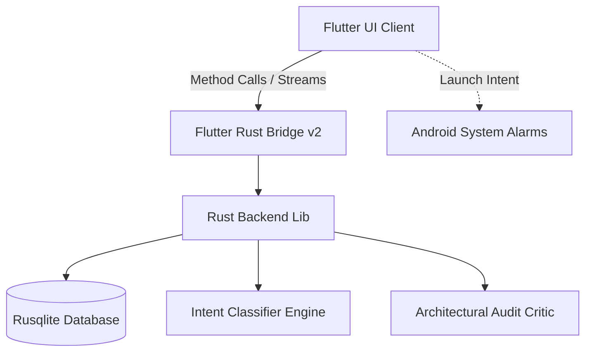

# 💡 FastReminder (Thoughts)

A high-fidelity, hybrid **Flutter + Rust** reminders, task management, and project canvas application. Features dynamic Rust-based intent classification, a local SQLite-backed architecture, slash-command expansions, and a satisfying, haptically-rich dark UI styled with pastel Material You colors.

---

## 🏗️ Architecture & Technology Stack

FastReminder is architected as a hybrid mobile/desktop application:
- **Frontend (Flutter & Dart):** High-framerate responsive UI with smooth micro-animations, page transitions, custom paint grids, gesture-based folder navigation, and system-wide haptic feedback overlay.
- **Backend Core (Rust):** Embedded SQLite database handling persistence, dynamic text category classifiers, and codebase spec auditing.
- **Bridge (Flutter Rust Bridge v2):** Lightweight, zero-copy, compile-time binding generator bridging Dart stream listeners and synchronous/asynchronous Rust handlers.



---

## ✨ Key Features

### 1. Embedded SQLite with Rust
All tasks, pinning states, folder colors, notes, project canvases, checklist items, and attachment file paths are stored locally using a high-performance SQLite engine via Rust's `rusqlite` crate. Features reactive stream updates pushing new data to Dart UI listeners upon changes.

### 2. Rust-Powered Category Intent Classifier
Any note created is auto-classified on-the-fly.
- **Explicit Tagging:** Adding `@Folder` or `#Folder` in text routes the item directly to that folder category.
- **Semantic Classification:** A fast keyword- scoreboard scoring system in Rust classifies text semantically into category buckets (e.g. `Work`, `Shopping`, `Health`, `College`, `Social`, `Home`, `Finance`, `UI/UX`, `Backend`, `Database`, `Testing`, `DevOps`, `Icebox`, and `General`).

### 3. Interactive Project Canvas
- Grid-based visual boards supporting multi-folder lanes (`General`, `UI/UX`, `Backend`, `Database`, `Icebox`, etc.).
- Add photos directly inside specific folder lists.
- **Senior Developer Canvas Audit:** A Rust rule-engine analyzing specifications for architectural pitfalls like SQLite binary storage size-bloat, Tokio scheduler starving block calls, cache OOM leak indicators, plaintext secrets, lock contention issues, and early-stage scope-creep.

### 4. Rich Media Attachments
- File, Image, and Video player attachments rendering inline.
- Supports browsing local files, gallery picking, camera snapping, and video play/pause toggles.

### 5. Multi-Folder Swipe Navigation
- Smooth horizontal drag/swipe gestures on the main dashboard to cycle through folder filters rapidly.

---

## ⚡ Slash Command expansions

Type slash commands in the text box for specialized rich widgets:

| Command | Action | Example |
|---|---|---|
| `/l` | **Checklist** - Creates a checklist list card | `/l Groceries` |
| `/a` | **Alarm** - Sets a countdown timer and hooks into system Alarms | `/a Meetup in 10m` |
| `/n` | **Note** - Creates a long-form pastel-themed text editor | `/n Design Doc` |
| `/p` | **Project** - Creates/routes an item inside a project canvas | `/p AppName :backend Create API` |
| `/c` | **Counter** - Creates an interactive, tactile counter card | `/c Push-ups` |

---

## 🎮 Tactile & Responsive Haptics

Haptic feedback is deeply baked into the interaction layer:
- **Buttons, Alarms, Commands:** Quick, satisfying `lightImpact()` haptic pulses when buttons are pressed.
- **Checklist Ticks & Action Items:** `mediumImpact()` taps on completion checkmarks.
- **Deletions & High-Priority Actions:** Strong `heavyImpact()` triggers on deletion.
- **Swiping Navigation:** Haptic selection indicators when swiping through folders.

---

## 🚀 Setting Up & Running Local Development

### Prerequisites
1. **Flutter SDK:** installed and configured.
2. **Rust Toolchain:** installed (via `rustup`).
3. **Rust Target:** Add appropriate target depending on compilation (e.g., `rustup target add aarch64-linux-android` for Android build).

### Steps to Run
1. **Clone the repository.**
2. **Generate Flutter-Rust bindings:**
   If you make changes to the Rust API (`rust/src/api/`), run:
   ```bash
   npx flutter_rust_bridge_codegen generate
   ```
3. **Install dependencies:**
   ```bash
   flutter pub get
   ```
4. **Compile and Launch:**
   Launch on your emulator or connected device:
   ```bash
   flutter run
   ```
